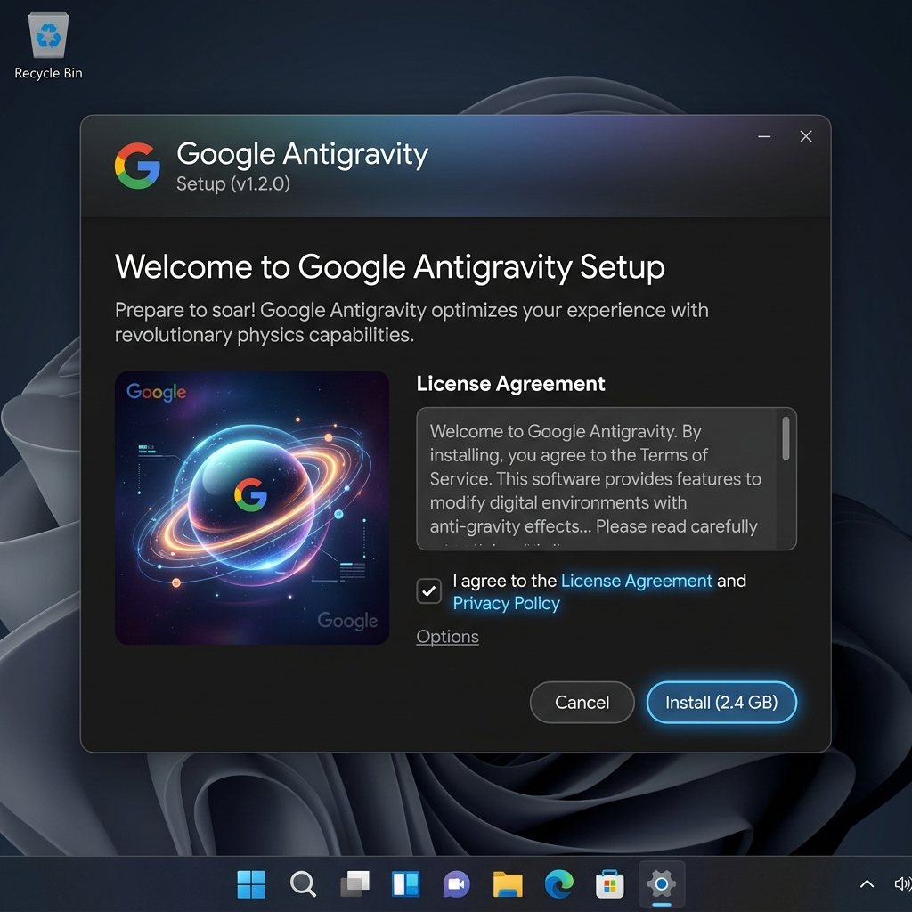
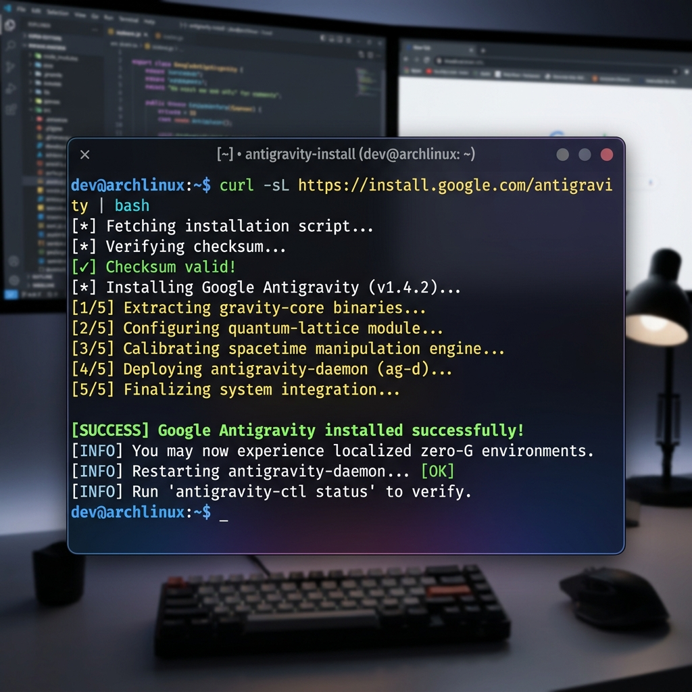
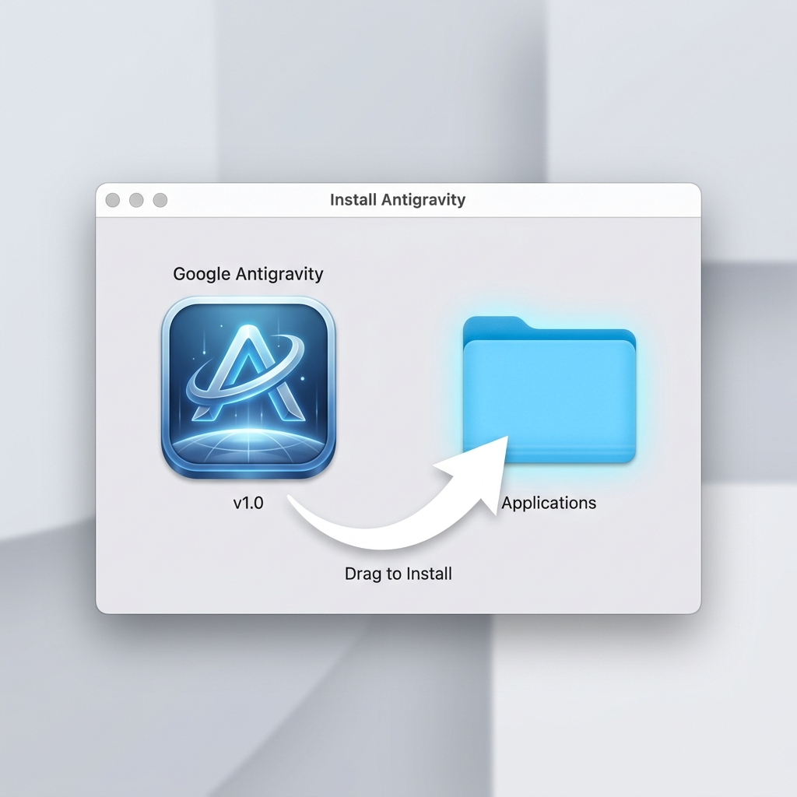
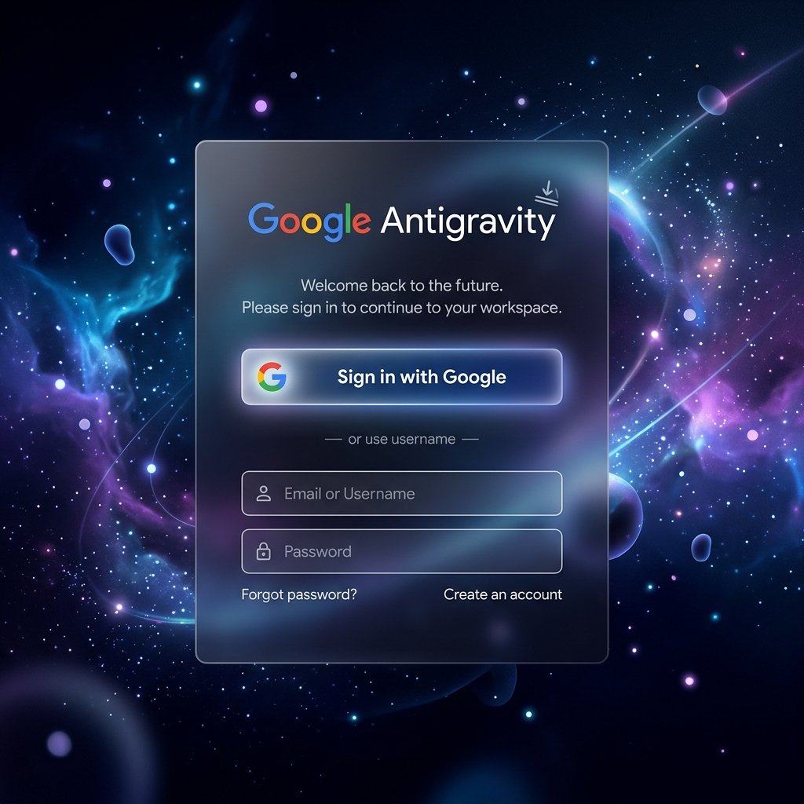
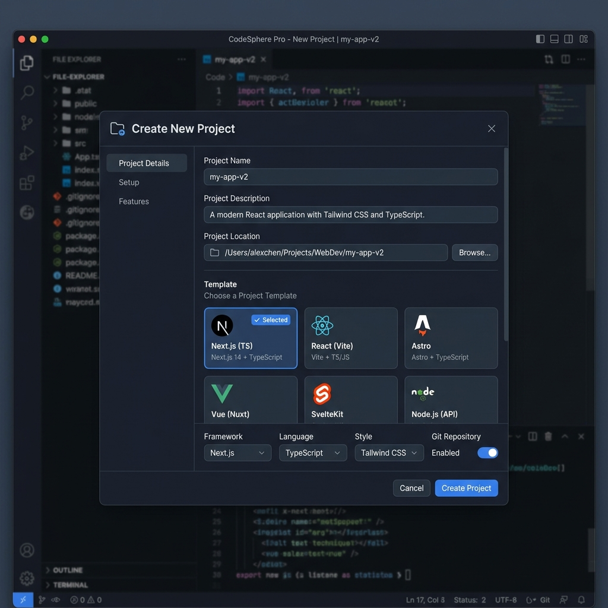

# Tutorial de Instalação e Configuração do Google Antigravity

Este tutorial tem como objetivo orientar a instalação e configuração inicial do **Google Antigravity** em ambientes Windows, Linux e macOS.

---

## Índice
1. [Requisitos](#1-requisitos)
2. [Download](#2-download)
3. [Instalação no Windows](#3-instalação-no-windows)
4. [Instalação no Linux](#4-instalação-no-linux)
5. [Instalação no macOS](#5-instalação-no-macos)
6. [Primeiro Acesso e Login](#6-primeiro-acesso)
7. [Criando o Primeiro Projeto](#7-criando-o-primeiro-projeto)
8. [Testando a Instalação](#8-testando)
9. [Solução de Problemas](#9-solução-de-problemas)

---

## 1. Requisitos

Antes de iniciar a instalação, certifique-se de que atende a todos os pré-requisitos listados abaixo:

*   **Conta Google ativa**: Necessária para o primeiro acesso e sincronização de dados. 🔗 [Ajuda com a Conta Google](https://support.google.com/accounts)
*   **Conexão estável com a internet**: Para baixar o instalador e validar o login.
*   **Permissões de instalação**: Você deve ter privilégios administrativos no computador para concluir o processo de configuração.
*   **Espaço livre em disco**: Aproximadamente **500 MB** disponíveis.
*   **Sistema Operacional**:
    *   Windows 10 ou posterior
    *   macOS 12 (Monterey) ou posterior
    *   Distribuições Linux populares compatíveis (Ubuntu 20.04+, Debian, Fedora, etc.)

---

## 2. Download

Para obter a versão oficial do instalador:

1.  Acesse o portal oficial: [https://antigravity.google/download](https://antigravity.google/download).
2.  Escolha a versão compatível com seu sistema operacional (Windows, Linux ou macOS).
3.  Clique em baixar para iniciar o download do arquivo de instalação.


---

## 3. Instalação no Windows

> [!WARNING]
> Caso sua conta de usuário não seja administradora, execute o instalador com privilégios de Administrador (clique com o botão direito e selecione **"Executar como Administrador"**).

Siga o passo a passo abaixo para concluir a instalação:

1.  Localize e execute o arquivo `.exe` baixado.
2.  Aceite o **Aviso de Controle de Conta de Usuário (UAC)** se solicitado pelo Windows.
3.  Leia e aceite os **Termos de Licença e Serviço**.
4.  Escolha a pasta de destino (o padrão é recomendado: `C:\Program Files\Google\Antigravity`).
5.  Clique em **Install** para prosseguir com a cópia dos arquivos.
6.  Aguarde a conclusão e clique em **Finish** para finalizar.



---

## 4. Instalação no Linux

A instalação em sistemas Linux é realizada via CLI (Linha de Comando).

1.  Abra o terminal de sua distribuição Linux.
2.  Execute o comando abaixo para baixar e executar o script de instalação automática:

```bash
curl -fsSL https://antigravity.google/cli/install.sh | bash
```

3.  Após a conclusão da instalação, verifique se a CLI está respondendo rodando:

```bash
antigravity --version
```

🔗 [Mais detalhes sobre o cURL no Linux](https://curl.se/)



---

## 5. Instalação no macOS

A instalação no macOS utiliza a interface tradicional de arrastar e soltar (`.dmg`).

1.  Dê um duplo clique no arquivo `.dmg` baixado para abri-lo.
2.  Arraste o ícone do **Google Antigravity** para a pasta **Applications** (Aplicações).
3.  Ao abrir pela primeira vez, caso o macOS bloqueie pelo Gatekeeper, autorize o aplicativo nas **Configurações do Sistema > Privacidade e Segurança**.
4.  Para instalar os utilitários de linha de comando no Terminal do macOS, execute o comando correspondente:

```bash
curl -fsSL https://antigravity.google/cli/install.sh | bash
antigravity --version
```

🔗 [Entenda o Gatekeeper e a Segurança no macOS](https://support.apple.com/pt-br/HT202491)



---

## 6. Primeiro Acesso

Com o aplicativo instalado com sucesso, o próximo passo é realizar a autenticação:

1.  Inicie o **Google Antigravity** a partir da sua lista de programas.
2.  Clique no botão **"Sign in with Google"** (Fazer login com o Google).
3.  Uma janela do navegador será aberta. Insira as credenciais da sua Conta Google.
4.  Conceda as permissões necessárias para que o Antigravity acesse os dados do seu workspace.
5.  Retorne ao aplicativo e aguarde a sincronização inicial terminar.

> [!TIP]
> Utilize a mesma conta Google onde você armazena seus projetos e serviços na nuvem para garantir a sincronização em tempo real de suas configurações.



---

## 7. Criando o Primeiro Projeto

Após realizar a autenticação, configure seu primeiro workspace:

1.  Na tela inicial do aplicativo, clique no botão **New Project** (Novo Projeto).
2.  Selecione a opção **Add Folder** (Adicionar Pasta) ou escolha uma pasta existente em seu disco.
3.  Navegue até o diretório desejado onde seus arquivos de desenvolvimento estão armazenados.
4.  Confirme a seleção e aguarde o Antigravity indexar os arquivos e inicializar o agente local.



---

## 8. Testando

Valide se todos os sistemas estão ativos de forma correta:

1.  Abra o painel de chat integrado do Google Antigravity.
2.  Digite a seguinte instrução:
    ```
    Help me understand this project.
    ```
3.  Confirme que o agente analisa sua estrutura de pastas e responde detalhadamente.
4.  Utilize o checklist de sucesso:
    *   [ ] Instalação concluída com sucesso
    *   [ ] Login via Conta Google efetuado
    *   [ ] Pasta do projeto adicionada ao workspace
    *   [ ] Resposta do chat funcionando e interpretando o código

---

## 9. Solução de Problemas

Se encontrar erros, tente os passos rápidos de solução a seguir:

*   **O aplicativo não abre após instalação**:
    *   *Solução*: Reinicie seu computador ou reinstale o aplicativo executando como Administrador (Windows).
*   **O login do Google falha**:
    *   *Solução*: Verifique sua conexão de rede. Caso use uma VPN corporativa ou firewall restritivo, certifique-se de que os domínios `*.google.com` e `*.antigravity.google` estão autorizados.
*   **Comando 'antigravity' não encontrado na CLI (Linux/macOS)**:
    *   *Solução*: Verifique se as variáveis de ambiente foram atualizadas. Rode `source ~/.bashrc` ou `source ~/.zshrc` no terminal, ou tente reinstalar via script curl.

---

*Tutorial elaborado como modelo dinâmico interativo.*
